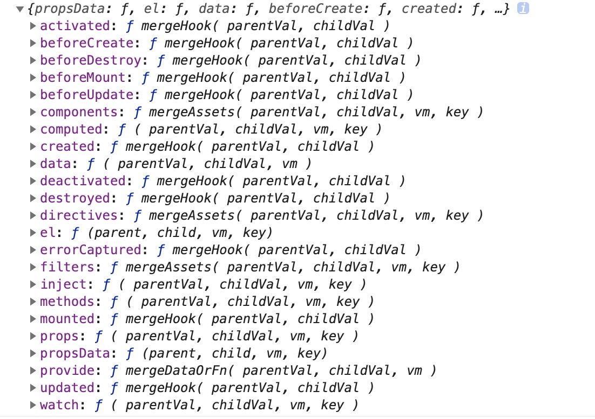

# mergeOptions函数  

源码注释如下 
> Merge two option objects into a new one.
> Core utility used in both instantiation and inheritance.  

mergeOptions的功能是合并两个options对象,并生成一个新的对象。是实例化和继承中使用的核心方法。可见mergeOptions方法的重要性。   

`src/core/util/options.js`
```javascript
export function mergeOptions (
    parent: Object,     // 该实例构造函数上的options
    child: Object,      // 实例化时传入的options
    vm?: Component      // 实例自身
): Object {
    // 检查传入的options.components选项的名字是否符合规定（非内置标签）
    if (process.env.NODE_ENV !== 'production') {
        checkComponents(child)
    }

    if (typeof child === 'function') {
        child = child.options
    }

    // 将传入的child.props转换为驼峰式结构的对象表达形式.
    // props能使用数组和对象语法，
    // 但在内部都会重新遍历封装到一个新对象中。
    normalizeProps(child, vm)

    normalizeInject(child, vm)

    // directives使用对象语法，对象中属性的值只能为函数，该操作会将函数绑定到指令的bind和update函数上
    normalizeDirectives(child)

    // 若存在extends，则将其内容合并到父对象parent中保存，最后再和自身child合并，extends最好是对象语法
    const extendsFrom = child.extends
    if (extendsFrom) {
        parent = mergeOptions(parent, extendsFrom, vm)
    }

    // 若存在mixins，则将其内容合并到父对象parent中保存，最后再和自身child合并，mixins只能是数组语法，数组中元素可以是对象
    if (child.mixins) {
        for (let i = 0, l = child.mixins.length; i < l; i++) {
            parent = mergeOptions(parent, child.mixins[i], vm)
        }
    }

    // 初始化一个对象，用于存储parent和child合并后的内容，并作为mergeOptions函数的结果返回
    const options = {}
    let key
    for (key in parent) {
        mergeField(key)
    }
    for (key in child) {
        if (!hasOwn(parent, key)) {
            mergeField(key)
        }
    }

    // 使用策略对象对parent和child进行合并
    function mergeField (key) {
        const strat = strats[key] || defaultStrat
        options[key] = strat(parent[key], child[key], vm, key)
    }

    return options
}
``` 

从源码可以看到，传入的参数parent，child，vm分别表示 该实例构造函数上的options，实例化时传入的options，实例自身，并最终返回合并的options，执行过程中，会先调用`checkComponents(child)`，检查传入的options.components选项的名字是否符合规定，然后调用

```javascript
normalizeProps(child, vm)
normalizeInject(child, vm)
normalizeDirectives(child)  
```

分别是把options中的[props](https://cn.vuejs.org/v2/guide/components-props.html)、[inject](https://cn.vuejs.org/v2/api/#provide-inject)、[directives](https://cn.vuejs.org/v2/guide/custom-directive.html)进行格式化，将其转换成对象的形式

#### normalizeeProps
当props是数组的时候，如下面这种情况  

```javascript

Vue.component('blog-post', {
    props: ['postTitle'],
    template: '<h3>{{ postTitle }}</h3>'
})
```

它的处理逻辑是，遍历props数组，把数组的每一项的值作为res对象的key，value值等于{type: null},即把上面例子中的['postTitle']转换成下面这种形式

```javascript
{
    postTitle: { type: null }
}
```

当props是对象的时候，如下面这种情况  

```javascript
Vue.component('my-component', {
  props: {
    // 必填的字符串
    propC: {
        type: String,
        required: true
    }
  }
})
```

这种情况的处理逻辑是遍历对象，先把对象的key值转换成驼峰的形式。然后再判断对象的值，如果是纯对象（即调用`object.prototype.toString`方法的结果是`[object Object]`）,则直接把对象的值赋值给res,如果不是,则把`{ type: 对象的值}`赋给res。最终上面这种形式会转换成

```javascript
{
    propC: {
        type: String,
        required: true
    }
}
```

#### normalizeInject
和normalizeProps的作用类似
```javascript
// array
var Child = {
    inject: ['foo'],
    created () {
        console.log(this.foo) // => "bar"
    }
  // ...
}

// object
const Child = {
    inject: {
        foo: {
            from: 'bar',
            default: 'foo'
        }
    }
}

// ======================
// 转换后

// array
{
    foo: { from: 'foo'}
}

// object
{
    foo: {
        from: 'bar',
        default: 'foo'
    }
}
```

#### normalizeDirectives
方法主要是处理一些[自定义指令](https://cn.vuejs.org/v2/guide/custom-directive.html)，这里的方法处理逻辑主要针对自定义指令中[函数简写](https://cn.vuejs.org/v2/guide/custom-directive.html#函数简写)的情况。

```javascript
Vue.directive('color', function (el, binding) {
    el.style.backgroundColor = binding.value
})

// ======================
// 转换后

color: {
    bind: function (el, binding) {
        el.style.backgroundColor = binding.value
    },
    update: function (el, binding) {
        el.style.backgroundColor = binding.value
    }
}
```

继续来看后面的代码  
```javascript    
...
// 若存在extends，则将其内容合并到父对象parent中保存，最后再和自身child合并，extends最好是对象语法
const extendsFrom = child.extends
if (extendsFrom) {
    parent = mergeOptions(parent, extendsFrom, vm)
}

// 若存在mixins，则将其内容合并到父对象parent中保存，最后再和自身child合并，mixins只能是数组语法，数组中元素可以是对象
if (child.mixins) {
    for (let i = 0, l = child.mixins.length; i < l; i++) {
        parent = mergeOptions(parent, child.mixins[i], vm)
    }
}
...
```

这段代码的处理的逻辑是，当传入的options里有mixin或者extends属性时，再次调用mergeOptions方法合并mixins和extends里的内容到实例的构造函数options上（即parent options）比如下面这种情况，就会把传入的mounted, created钩子处理函数，还有methods方法提出来去和parent options做合并处理。    

```javascript
const myMixin = {
    created: function () {
        this.hello()
    },
    methods: {
        hello: function () {
            console.log('hello from mixin')
        }
    }
}

const myComponent = {
    mounted: function () {
        this.goodbye()
    },
    methods: {
        goodbye: function () {
            console.log('goodbye from mixin')
        }
    }
}

const childComponent = Vue.component('child', {
    ...
    mixins: [myMixin],
    extends: myComponent
    ...
})
```  

接下来就是mergeOption的合并策略核心部分
```javascript
 // 使用策略对象对parent和child进行合并
function mergeField (key) {
    const strat = strats[key] || defaultStrat
    options[key] = strat(parent[key], child[key], vm, key)
}
```

```javascript
// 默认合并策略
// 如果child上的属性存在，取child的属性，否则取parent上的属性
const defaultStrat = function (parentVal: any, childVal: any): any {
    return childVal === undefined
        ? parentVal
        : childVal
}
```  

合并策略strat的取值为`strats[key] || defaultStrat`，defaultStrat即如果child上的属性存在，取child的属性，否则取parent上的属性，strats会将[options.optionMergeStrategies](https://cn.vuejs.org/v2/api/#optionMergeStrategies)和vue默认定义的合并策略进行整合，我们可以看到，vue中已经定义的合并策略如下图


