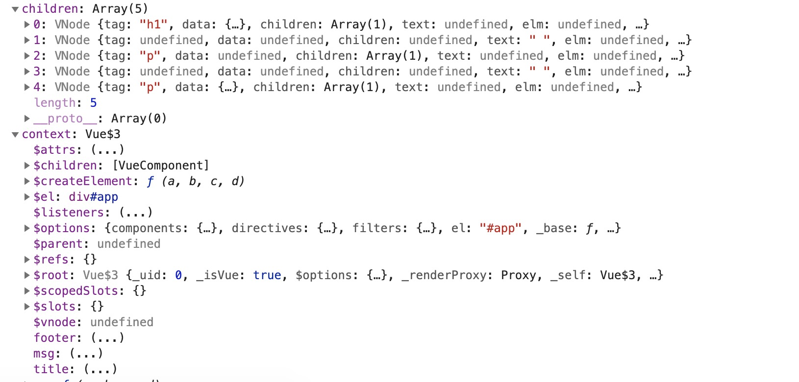
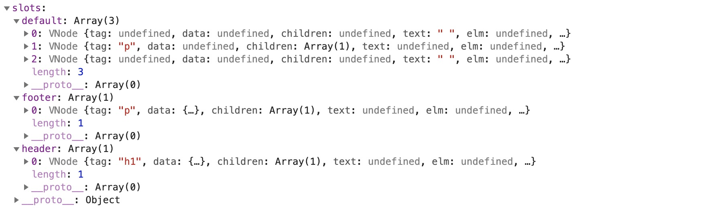
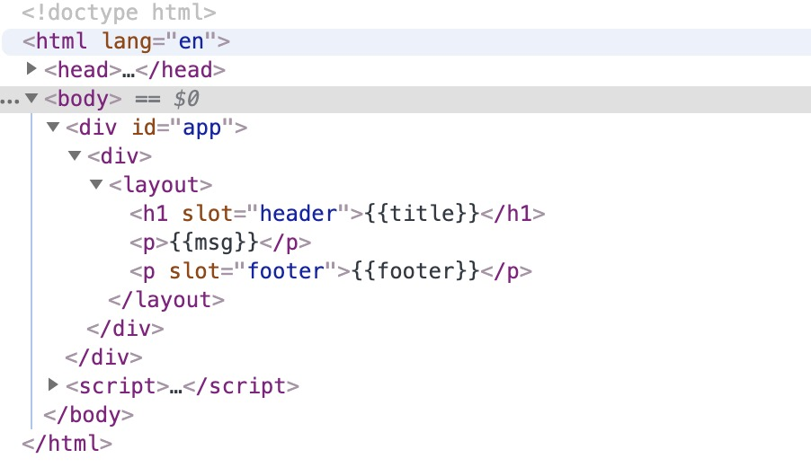
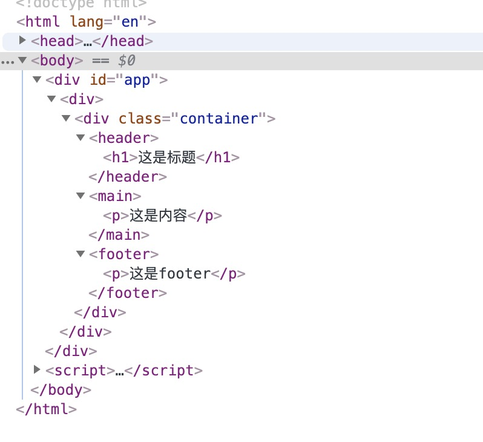

# initRender & resolveSlots 函数

`src/core/instance/render.js`

```javascript
export function initRender (vm: Component) {
    vm._vnode = null // the root of the child tree
    const options = vm.$options

    const parentVnode = vm.$vnode = options._parentVnode // the placeholder node in parent tree
    const renderContext = parentVnode && parentVnode.context

    // 处理组件slot，返回slot插槽对象
    vm.$slots = resolveSlots(options._renderChildren, renderContext)
    vm.$scopedSlots = emptyObject

   
    vm._c = (a, b, c, d) => createElement(vm, a, b, c, d, false)
    vm.$createElement = (a, b, c, d) => createElement(vm, a, b, c, d, true)

    const parentData = parentVnode && parentVnode.data

    if (process.env.NODE_ENV !== 'production') {
        defineReactive(vm, '$attrs', parentData && parentData.attrs || emptyObject, () => {
            !isUpdatingChildComponent && warn(`$attrs is readonly.`, vm)
        }, true)
        defineReactive(vm, '$listeners', options._parentListeners || emptyObject, () => {
            !isUpdatingChildComponent && warn(`$listeners is readonly.`, vm)
        }, true)
    } else {
        defineReactive(vm, '$attrs', parentData && parentData.attrs || emptyObject, null, true)
        defineReactive(vm, '$listeners', options._parentListeners || emptyObject, null, true)
    }
}
```  

initRender函数中，主要执行两部分内容，第一部分：将children VNode转换成slots对象：  
```javascript
vm.$slots = resolveSlots(options._renderChildren, renderContext)
```

`src/core/instance/render-helpers/resolve-slots.js`

```javascript
export function resolveSlots (
    children: ?Array<VNode>,    // 占位符Vnode里的内容
    context: ?Component         // 占位符Vnode所在的Vue实例
): { [key: string]: Array<VNode> } {
    const slots = {}

    // 如果引用当前组件时没有子节点，则返回空对象
    if (!children) {
        return slots
    }

    const defaultSlot = []

    // 遍历每一个子节点
    for (let i = 0, l = children.length; i < l; i++) {
        const child = children[i]
        const data = child.data     // 当前子节点的data属性

        // remove slot attribute if the node is resolved as a Vue slot node

        /* 移除slot属性
         * <span slot="abc"></span>
         * 编译成span的VNode节点data = {attrs:{slot: "abc"}, slot: "abc"}
         * 这里删除该节点attrs的slot
         */
        if (data && data.attrs && data.attrs.slot) {
            delete data.attrs.slot
        }

        /* 判断是否为具名插槽，如果为具名插槽，还需要 子组件 / 函数子组件 渲染上下文一致。
         * 主要作用：
         * 当需要向子组件的子组件传递具名插槽时，不会保持插槽的名字。
         */

        // named slots should only be respected if the vnode was rendered in the
        // same context.
        if ((child.context === context || child.functionalContext === context) &&
            data && data.slot != null
        ) {
            // 获取slot的名称
            const name = child.data.slot
            // 如果slots[name]不存在，则初始化为一个空数组
            const slot = (slots[name] || (slots[name] = []))

            // 处理父组件采用template形式的插槽
            // 如果是tempalte元素 则把template的children添加进数组中
            if (child.tag === 'template') {
                slot.push.apply(slot, child.children)
            } else {
                slot.push(child)
            }
        } else {
            // 返回匿名default插槽VNode数组
            defaultSlot.push(child)
        }
    }

    // ignore whitespace
    // 忽略仅仅包含whitespace的插槽
    if (!defaultSlot.every(isWhitespace)) {
        slots.default = defaultSlot
    }
    return slots
}
```

举个例子：  
```javascript
<div id="app">
    <div>
        <layout>
            <h1 slot="header">{{title}}</h1>
            <p>{{msg}}</p>
            <p slot="footer">{{footer}}</p>
        </layout>
    </div>
</div>


Vue.component('Layout', {
    template: `<div class="container">
                    <header>
                        <slot name="header">默认header</slot>
                    </header>
                    <main>
                        <slot>默认main</slot>
                    </main>
                    <footer>
                        <slot name="footer">默认footer</slot>
                    </footer>
                </div>`
})

new Vue({
    el: '#app',
    template: ``,
    data: {
        title: '这是标题',
        msg: '这是内容',
        footer:'这是footer'
    }
})
```  
可以看到，resolveSlots函数的入参分别为layout组件的children和layout所处的context即div#app  
  

经过resolveSlots解析后，返回的结果如下，并存储在vm.$slots中  
  


从DOM数的变化可以看到，渲染的过程其实就是通过name将`<slot>`替换为相应的内容，有关slot的详细内容将在后面的章节中进行讲解  

[^_^]:
    TODO slot的渲染过程

    渲染前：
    

    渲染完成后，会将原DOM中命名的`<slot>`替换成相应name的标签，未命名的`<slot>`替换成默认slot，
    
 


继续回到`initRender`，接下来就是该函数的第二个核心部分：  

```javascript
if (process.env.NODE_ENV !== 'production') {
    defineReactive(vm, '$attrs', parentData && parentData.attrs || emptyObject, () => {
        !isUpdatingChildComponent && warn(`$attrs is readonly.`, vm)
    }, true)
    defineReactive(vm, '$listeners', options._parentListeners || emptyObject, () => {
        !isUpdatingChildComponent && warn(`$listeners is readonly.`, vm)
    }, true)
} else {
    defineReactive(vm, '$attrs', parentData && parentData.attrs || emptyObject, null, true)
    defineReactive(vm, '$listeners', options._parentListeners || emptyObject, null, true)
}
```  

这里，最要调用了`defineReactive`方法，将[`$attrs`](https://cn.vuejs.org/v2/api/#vm-attrs)和[`$listeners`](https://cn.vuejs.org/v2/api/#vm-listeners)设置成可监听的。